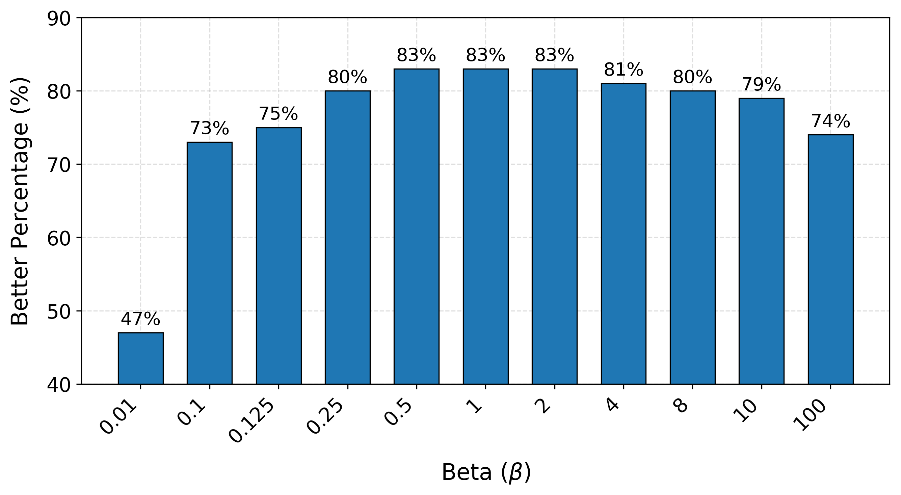
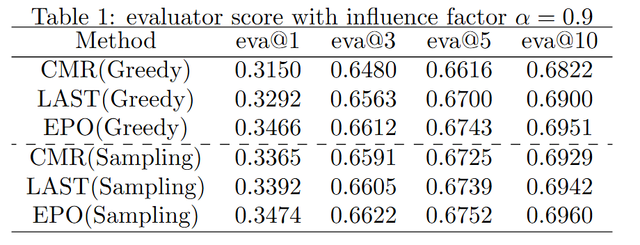
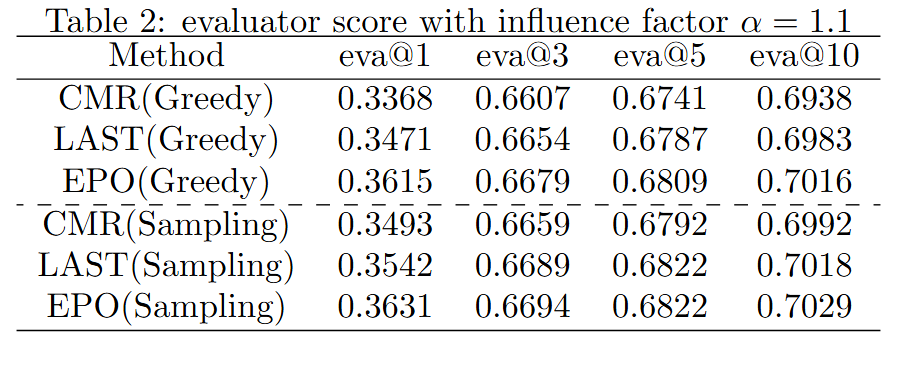
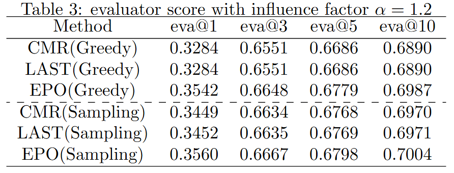

# EPO

EPO is an extended version of [LAST](https://github.com/lyingCS/LAST) and [librerank](https://github.com/LibRerank-Community/LibRerank)

## Quick Started

### Install repo from source

```
git clone https://github.com/Divpeter/EPO.git
cd EPO
make init 
```

### Decompress evaluator checkpoint

For facilitate the training of the generator, we provide a  version of the checkpoints of EPO_evaluator that have been pretrained. Please ensure you have Git LFS installed and fetch the EPO_evaluator model files after cloning the repository. 

```
git lfs pull
```

Then you need to decompress it.

```
tar -xzvf ./model/save_model_ad/10/*.tar.gz -C ./model/save_model_ad/10/
```

### Train EPO

```
python run_reranker.py
```

Model parameters can be set by using a config file, and specify its file path at `--setting_path`, e.g., `python run_ranker.py --setting_path config`. The config files for the different models can be found in `example/config`. Moreover, model parameters can also be directly set from the command line.

### Eval EPO model

```
python eval_last_model.py --reload_path='path/to/model/you/trained'
```

## More Experimental Analysis
### Neural_sort Hyper_parameters Beta Analysis
In this experiment, we investigate the influence of  $\beta$, which is the scale parameter of the Gumbel noise. $\beta$ controls the mean and the variance at the same time. A large $\beta$ leads to a long tail probability distribution, which means it is more often to see large values of the noise. The noise is added to the clean rank score to provide randomness, which allows the policy to explore various list generation possibilities and ultimately find the best strategy. Cautious should be paid to interpret the hyperparameter. It is not a free parameter that controls the relative importance between the original rank score and the noise. In the original NeuralSort paper, Proposition 5 states that the perturbed rank score should be $\tilde s=\beta log(s) + g$, where $s$ is the clean rank score and $g$ is the noise sampled from $Gumbel(0, \beta)$. If we sample the noise $g_1$ from $Gumbel(0, 1)$, the equation can be rewritten into $\tilde s=\beta log(s) + \beta g_1$. Now it is clear that $\beta$ magnifies the original rank score and the strength in the same manner, not their relative importance. Nevertheless, it is interesting to see how the value of $\beta$ may influence the GLR model. We carry out two grid searches across $\beta$ values. The first is [0.01, 0.1, 1, 10, 100] and the second is [0.125, 0.25, 0.5, 1, 2, 4, 8]. The result is shown in the following figure. We can see that when $\beta$ is within [0.25, 8], the final Better Percentage (BP) can go above 80% and $\beta=1$ achieves the best result.



### Synthetic Data Experiment



